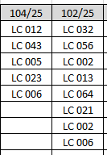

# Listar Equipamentos

❓ **Problema:** Necessidade de se rastrear cada um dos equipamentos utilizados para os ensaios realizados em laboratório.

---

😰 **Dificuldades:**

- Grande quantidade de ensaios, levando tempo para a extração dos dados manualmente
- Grande variedade de ensaios realizados, cada tipo contendo planilhas personalizadas e com células de posições diferentes contendo as informações desejadas, dificultando uma padronização na extração de dados em fórmulas do próprio Excel
- Preenchimentos não padronizados

💡 **Solução**:  Automatização em Python! ⚙️🐍

---
📚 **Bibliotecas Utilizadas**

📁 Pathlib

📈 OpenPyXL

---
📋 **Funcionamento**
- **percorrer_pastas**: Utilizando a biblioteca Pathlib, a função procura todos os elementos dentro da pasta geral onde estão armazenados os ensaios. A função é recursiva, o que significa que se ela se deparar com uma subpasta ela será chamada novamente, até que encontre um arquivo com extensão válida (.xlsx, .xlsm)
- **extrair_dados**: Para cada arquivo Excel encontrado, todas as células dentro de um intervalo determinado são inspecionadas. Então, extrai-se o *Número de Protocolo* e os *Equipamentos*. Esta seleção é realizada através da verificação da formatação de cada célula, que para o protocolo é 'XXX/2025' e para os equipamentos é 'LC YYY'. 
- **preencher_resumo**: Para cada conjunto de dados extraídos de um ensaio armazenado em uma variável (protocolo) e em uma lista (equipamentos), a função os exporta para um arquivo em Excel chamado 'Resumo', onde cada protocolo é disposto em uma coluna e os equipamentos de cada ensaio em diferentes linhas. 

👇 **Exemplo - Planilha Resumo:**

